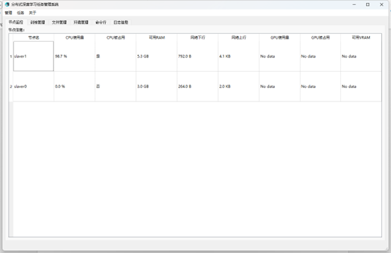
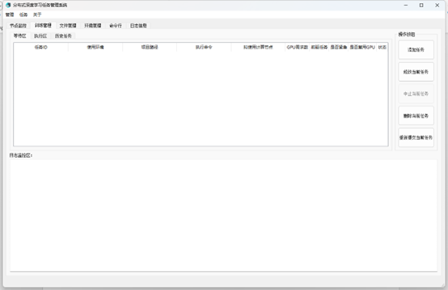
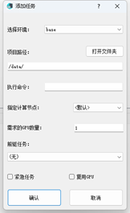
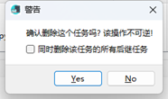
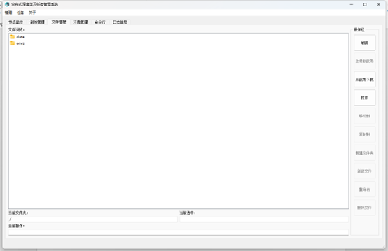
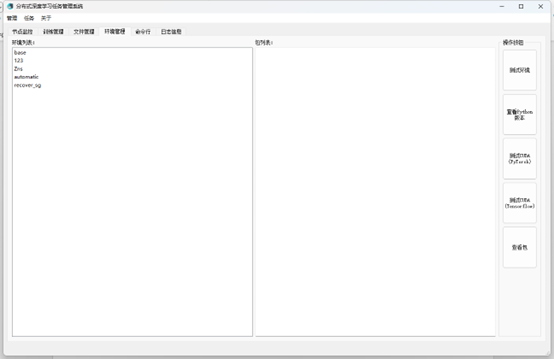
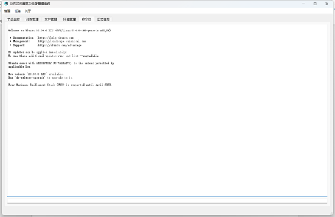
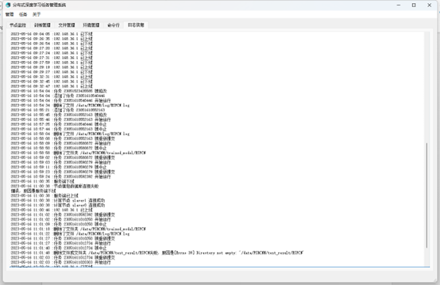

# 分布式深度学习任务管理系统客户端

## 1 环境要求

运行该客户端需要安装python，并安装以下包：

```
paramiko
PyQt5
PyQt5-Qt5
PyQt5-sip
PyQtWebEngine
PyQtWebEngine-Qt5
```

安装完成后运行以下命令即可开启客户端：

```
python run.py
```

需要注意的是，必须开启服务端后才可运行客户端，客户端在开启时会尝试与服务端进行通信，若通信失败则不会启动。另外，客户端需要与服务端处于同一局域网内。

## 2 使用手册

### 2.1 服务器信息设置

运行软件之前，首先检查`server_info.json`文件与软件在同一目录中。一般情况下不要修改该文件，否则会导致与服务端连接失败。以下为该文件的字段信息和其含义：

| **字段名**       | **含义**               |
| ---------------- | ---------------------- |
| IP               | 服务端IP地址           |
| username         | 服务端用户名           |
| psw              | 服务端密码             |
| ssh_port         | 服务端SSH端口          |
| monitor_port     | 服务端节点监控通信端口 |
| data_port        | 服务端交互通信端口     |
| train_state_port | 服务端任务监控通信端口 |
| buffer           | 端口缓冲区大小         |

### 2.2 节点监控界面

启动软件后默认进入节点监控界面，在该界面可以查看所有计算节点的信息，如下图所示：



该界面会自动更新计算节点的状态，若有节点掉线也会从界面中删除。该界面不需要进行任何操作。

### 2.3 训练管理界面

训练管理界面包括“等待区”、“执行区”和“历史任务”三个子界面；“添加任务”、“修改当前任务”、“中止当前任务”、“删除当前任务”和“重新提交当前任务”五个按钮，以及日志监控区的界面。用户可以切换“等待区”、“执行区”和“历史任务”界面查看当前正在等待、训练以及结束的任务，也可以对任务进行增删查改操作。该界面如下诉所示：



#### 2.3.1 添加任务

点击“添加任务”按钮后弹出添加任务窗口，如下所示：



用户首先需要选择使用的环境；

再点击“打开文件夹”按钮选择项目所在的路径；

其次需要输入执行的命令，如“python train.py”等，需要注意的是，执行命令只能添加一条，若添加多条则可能会导致运行错误或者只运行了第一条命令；

如果需要指定任务在某个计算节点运行的话可以在指定计算节点下拉框中选择，若选择“<默认>”则会自动分配空闲节点；

之后需要设置这个任务需要的GPU数量，系统会自动分配GPU来执行，若设置为0则表示只使用CPU进行运算，若设置数量大于计算节点所拥有的GPU数量则会导致任务一直处于等待状态；

若该任务需要在某个任务运行完成后才能执行，那么就可以设置其前驱任务，只有前驱任务运行结束后才会运行该任务，需要注意的是只要前驱任务运行结束（运行完成、被中止或运行错误）都会使得该任务开始运行；

若这个任务需要尽快完成，可以勾选“紧急任务”，系统会在存在空闲GPU的情况下优先运行紧急任务；

若这个任务占用的GPU显存比较小，则可以勾选“复用GPU”，系统会无视GPU占用情况直接将其添加到计算节点中可用显存较多的GPU上运行，但是这个有一点概率导致出现CUDA OOM错误；

最后，点击“确认按钮”即可提交任务。

#### 2.3.2 修改当前任务

用户可以修改处于等待区和历史任务区中的任务，处于执行区的任务无法修改。选中一个任务并点击“修改当前任务”按钮后弹出修改任务窗口，其与“添加任务”窗口一致，用户只需要在窗口中对任务信息进行修改即可。若用户修改了历史任务区里的任务，在点击“确认”按钮后系统会将该任务放入等待区。需要注意的是，修改任务窗口有一定概率会把环境设置为“base”，需要在确认前进行检查。

#### 2.3.3 中止当前任务

用户可以中止正在运行的任务。首选选中执行区的一个任务，然后点击“中止当前任务”按钮即可中止该任务。需要注意的是，点击之后任务会被立即中止，在点击前请仔细检查，不要停掉了别人的任务。

#### 2.3.4 删除当前任务

用户可以删除位于等待区和历史任务区的任务。选中一个需要删除的任务，然后点击“删除当前任务”按钮，软件会提示是否确认删除，如下所示：



用户点击“Yes”按钮后任务即被删除，如果该任务存在后继任务，在删除时若需要同时将所有后继任务删除，则可以勾选“同时删除该任务的所有后继任务”，系统会自动将该任务的所有后继任务删除。需要注意的是，删除后继任务是递归执行的，该任务后继的后继也会被一并删除。

#### 2.3.5 重新提交当前任务

用户可以重新提交为于等待区和历史任务区的任务。选中一个需要重新提交的任务，然后点击“重新提交当前任务”按钮，系统会为该任务分配一个新的任务ID，并将其放入等待区。

#### 2.3.6 查看任务日志

用户可以查看位于执行区和历史任务区里任务的日志。双击一个任务即可将其日志显示在日志监控区里。如果双击的任务位于执行区，系统会实时获取任务的日志信息并实时更新。

### 2.4 文件管理界面

用户可以对系统中的文件进行管理，该界面类似于资源管理器，如下所示：



双击为打开文件夹或查看文件；

单击为选中文件夹或文件；

进入文件夹后点击“上传到此处”可以将本地的文件上传至系统的对应文件夹中；

进入文件夹后可以选择一个文件或文件夹，并点击“从此处下载”即可将选中的文件或文件夹下载到本地；

选中一个文件或文件夹后点击“移动到”或“复制到”按钮可以将选中的文件或文件夹移动或复制到系统的其他位置；

进入文件夹后可以点击“新建文件夹”或“新建文件”按钮，输入名称即可创建文件夹或文件；

选中一个文件夹或文件后点击“重命名”按钮即可对该文件夹或文件进行重命名操作；

选中一个文件夹或文件后点击“删除文件”按钮即可删除该文件或文件夹，需要注意的是在删除文件夹时只能删除空文件夹，否则会报错。

此外，用户也可以通过Samba服务上传文件或文件夹，**需要注意的是，在上传前建议将文件权限设置为777，以避免系统无法执行文件**。

### 2.5 环境管理界面

用户可以对系统中存在的环境进行管理，该页面由“环境列表”，“包列表”两个界面和“测试环境”，“查看Python版本”，“测试CUDA(PyTorch)”，“测试CUDA(TensorFlow)”和“查看包”五个按钮组成，如下所示：



环境列表中显示了当前存在的所有环境，用户可以单击选中一个环境。

选中环境后点击“测试环境”按钮，系统会执行“conda activate”命令，检查是否可以激活环境，若可以激活就返回“测试成功”，不能激活则返回“测试失败”；

选中环境后点击“查看Python版本”按钮，系统会执行“python -V”命令，返回该环境的Python版本；

若环境中存在PyTorch，可以点击“测试CUDA(PyTorch)”按钮，系统会调用环境中的PyTorch，并返回CUDA能否使用，若环境中没有PyTorch则会返回错误；

若环境中存在TensorFlow，可以点击“测试CUDA(TensorFlow)”按钮，系统会调用环境中的TensorFlow，并返回CUDA能否使用，若环境中没有TensorFlow则会返回错误；

选中环境后点击“查看包”按钮，系统会执行“conda list”命令，并把环境中存在的所有包显示在“包列表”中。

 

需要注意的是，系统采用Miniconda3管理环境，环境文件夹位于“/envs/miniconda3/envs/”，若需要添加自己的环境，需要把文件夹复制到环境文件夹中，此外，**上传前将自己的环境中的所有文件和文件夹权限设置为777，同时需要修改环境中的默认路径，以免无法使用**。

### 2.6 命令行界面

用户可以使用该软件对系统进行一些基础的命令行操作，界面如下所示：



在下面的文本框中输入命令，按回车即可提交给系统，系统执行后将结果返回在上面的文本框中。

该界面只能实现一些基础的命令行操作，若需要进行一些别的操作，可以通过ssh连接到服务端实现。

### 2.7 日志信息界面

用户可以查看系统服务端的日志信息，如下所示：



 