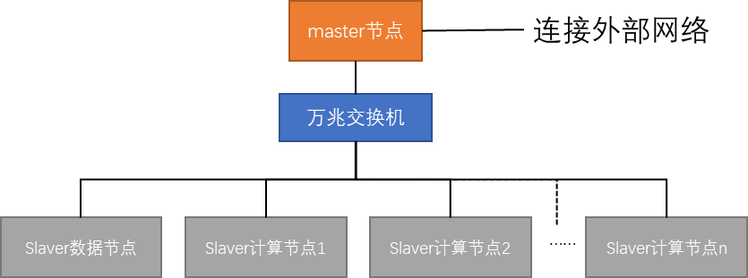

# 分布式深度学习任务管理系统服务端

## 1 环境要求

运行该服务端需要Linux操作系统，并安装python，以下为需要的包：

```
gputil
openssl
paramiko
pysocks
```

## 2 系统部署

服务端分为主节点和计算节点两部分，主节点和计算节点都需要安装Ubuntu操作系统，并建立相同的账户和密码，需要在主节点安装以下软件：

```
sudo apt-get install nfs-kernel-server
sudo apt-get install samba samba-common
apt-get install ssh
```

此外，还需要安装Nvidia显卡驱动和CUDA。

在计算节点上安装以下软件：

```
sudo apt-get install nfs-common
apt-get install ssh
```

同时，还需要在所有计算节点上安装Nvidia显卡驱动和CUDA。

### 2.1 系统架构

系统使用master-slaver架构，系统中存在一个master节点和多个slaver节点。其中，slaver节点包含了GPU计算节点和数据节点两种。此外，数据节点也可以由master节点承担。以下为系统架构图：



为了确保数据传输速度，系统内部采用万兆局域网连接。通过实验发现，若无搭建万兆局域网的条件，千兆局域网也能够满足要求，但是可能存在性能衰减。需要注意的是，slaver节点只负责计算或数据存储操作，不需要直接和外部网络连接。

在预算有限的情况下，数据节点可以取消，并将数据放在master节点上。

### 2.2 文件管理

本系统采用NFS来管理文件。文件分为两个部分，分别是环境(envs)和数据(data)。在实际实现时，可以将envs放在固态硬盘上获得更快的加载速度；将data放在机械硬盘上，从而具有更大的存储容量。

以下为实现步骤：

1）在数据节点上分别创建envs和data文件夹（位于“/home/<user>/”下）；

2）在envs文件夹下安装miniconda3；

3）在数据节点上安装NFS服务，在master和所有计算节点上安装NFS客户端，并设置开机自启动；

4）将数据节点的envs和data映射至master和所有计算节点，并设置开机自动挂载（绝对路径与数据节点相同，且user_name相同）；

5）向master和所有计算节点的.bashrc中添加conda init相关命令，启用conda；

6）在master和所有计算节点测试conda是否能成功使用，并测试data文件夹是否正常；

7）在master节点安装samba服务，并添加envs和data，从而实现在外部访问。

在后续的操作中，只需要将自己的环境拷贝至“~/envs/miniconda3/envs/”中即可使用。并可以通过“conda activate <your_env>”来测试环境是否可用，也可以在系统对你添加的环境进行测试。

此外，miniconda3的base环境中包含了管理系统运行所必须的一些库，最好不要对base进行修改。

对于数据文件，可以使用windows的映射网络驱动器（需要开启smb服务）功能，并通过samba服务将其映射至自己的电脑上。

### 2.3 节点监控

节点监控采用Influxdb + Grafana实现。Influxdb是一种时序数据库，用于存储每个节点在所有时间的运行状态，Grafana是一个数据可视化平台。以下为操作步骤：

1）在master分别安装influxdb和grafana，并设置开机自启动；

2）在influxdb中添加一个数据库，并在grafana中进行设置；

3）修改monitor.py文件中的数据库信息。

4）启动系统。

节点监控部分基于[github_link](https://github.com/Variante/gpu_cluster_monitor)开发，详细操作可见链接。

### 2.4 节点管理

节点信息被保存在`gpu_slaver_info.json`中，其采用list数据结构保存，其中列表的每个值是一条节点信息，节点信息具体含义如下所示：

```
name：节点名；
ip：节点的IP地址；
user_name：节点用户名，所有节点以及主节点必须使用一样的用户名；
gpu_count：该节点所包含的GPU数量；
gpu_info：该节点的GPU名称。
```

以下为一条节点信息的示例：

```
{
  "name": "Slaver1", 
  "ip": "192.168.36.130", 
  "user_name": "aaaaa", 
  "gpu_count": 3, 
  "gpu_info": ["RTX3090", "RTX3090", "RTX1080ti"]
 }
```

系统在运行时会每隔一分钟加载一次节点信息文件，因此平时不要动这个文件。若需要添加节点，则直接在文件中输入新节点信息即可，系统会自动更新自己的节点信息。

## 3 运行

在配置好环境以及部署完成之后，运行`main.py`即可。

## 4 文件说明

master文件夹内为该系统运行所需文件，如下所示：

```
--master
|--task_info
| |--exec_task.json
| |--wait_task.json
| |--hist_task.json
|--communicate.py
|--conf.json
|--config.py
|--gpu_slaver_info.json
|--global_var.py
|--logger.py
|--main.py
|--monitor.py
|--process.py
|--psw
|--task_ctrl.py
```

其中：

`task_info`文件夹中的三个文件用于离线保存等待任务、执行任务和历史任务，避免服务端掉线后任务丢失；

`communicate.py`文件中实现了客户端与服务端的通信

`conf.json`中保存了服务端的一些设置，如下所示：

```
"visible_folders": ["data", "data_ssd", "envs"],    #客户端可见的文件夹
"root": "/home/xxx/",    #系统所在文件目录
"psw_file": "./psw",    #密码文件路径
"slaver_file": "./gpu_slaver_info.json",    #计算节点信息存放路径
"train_log_path": "data/task_logs/" ,    #训练日志存放路径
"server_log_path": "/home/xxx/master/server_log.log",    #服务端日志存放路径
"socket_info": {    #服务端与客户端之间通信的设置
        "monitor_port": 63004,    #节点监控端口
        "data_port": 63005,    #交互端口
        "train_state_port": 63006,    #训任务状态监控端口
        "buffer": 1048576,    #端口缓冲区大小
        "listen": 100    #最大连接数
    }

```

`config.py`文件用于获得系统的配置文件

`gpu_slaver_info.json`存放计算节点信息

`global_var.py`用于定义一些全局变量

`logger.py`用于记录服务端日志

`main.py`主文件，服务端的入口

`monitor.py`实现了监视节点信息

`process.py`处理客户端发来的信息，实现了客户端与服务端的交互操作

`psw`密码文件

`task_ctrl.py`实现了任务控制，任务管理的核心模块